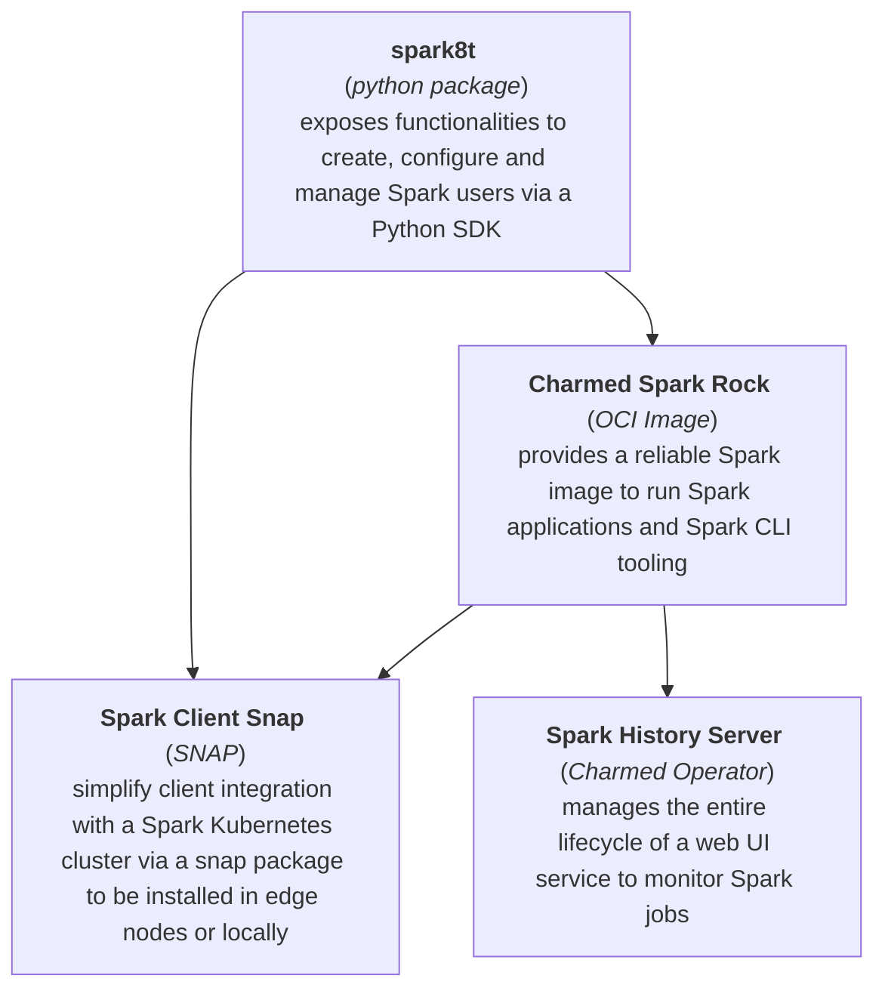

## Charmed Spark Components Overview

The Charm Spark Solution bundles the following components:

* [spark8t](https://github.com/canonical/spark-k8s-toolkit-py), that is a Python package to enhance Spark capabilities allowing to manage Spark jobs and service accounts, with hierarchical level of configuration
* [Charmed Spark Rock](https://github.com/canonical/charmed-spark-rock/pkgs/container/charmed-spark) OCI-compliant Image, that bundles Spark binaries together with Canonical tooling to be used to start your Spark workload on Kubernetes, to use Charmed Spark CLI tooling or derive your own images from secured and supported bases;
* [Spark Client Snap](https://snapcraft.io/spark-client), to simplify Apache Spark installation on edge nodes or local machines, by leveraging on confined [SNAPs](https://snapcraft.io/) and exposing simple Snap commands to run and manage Spark Jobs 
* [Charmed Spark History Server](https://charmhub.io/spark-history-server-k8s) to deploy, manage and operate the Spark History Server (for enabling application log aggregation and metrics monitoring) using [Juju](https://juju.is/) 

The following image shows how the different artifacts interacts with each other:

The Charmed Spark solution can be used to deploy and manage Apache Spark workloads on any compliant Kubernetes distributions (for versions 1.26 and above), like
* [MicroK8s](https://microk8s.io/), which is the simplest production-grade conformant K8s. Lightweight and focused. 
Single command install on Linux, Windows and macOS. Refer to [here](https://microk8s.io/#install-microk8s) for more information. 
* [Charmed Kubernetes](https://ubuntu.com/kubernetes/charmed-k8s), which is a platform independent, model-driven distribution of Kubernetes powered by [juju](https://juju.is/) 
* [AWK EKS](https://ubuntu.com/kubernetes/charmed-k8s), which is the managed Kubernetes service provided by Amazon Web Services to run Kubernetes in the AWS cloud and on-premises data centers.

Setup instructions are available in the Spark Tutorial [Set up the environment chapter](https://discourse.charmhub.io/t/spark-client-snap-tutorial-setup-environment/8951)
