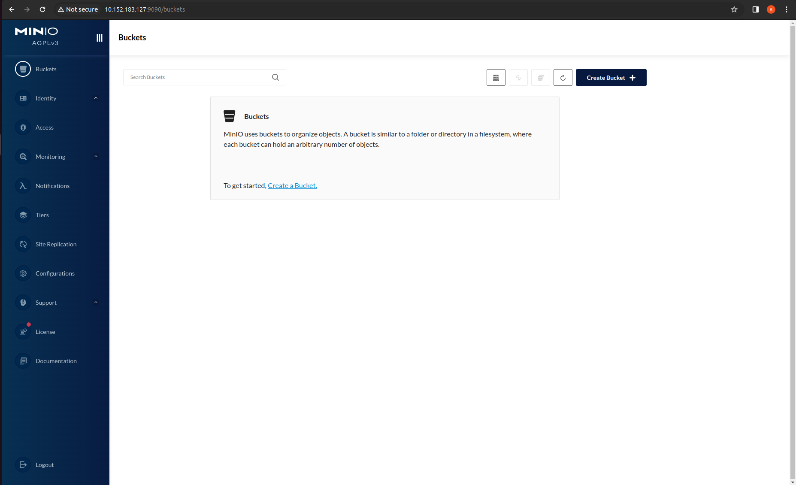

## Setup Environment for the Tutorial


### Minimum requirements
Before we start, make sure your machine meets the following requirements:
* Ubuntu 22.04 (jammy) or later (the tutorial has been prepared and tested to work on 22.04)
* 8 GB of RAM
* 2 CPU threads
* At least 20GB of available storage.
* Access to the internet for downloading the required snaps and charms.

### Prepare MicroK8s

Charmed Spark is developed to be run on top of a Kubernetes cluster. For the purpose of this tutorial, we are going to use [MicroK8s](https://microk8s.io/), a very simple production-grade conformant K8s that can run locally. 

Installing MicroK8s is as simple as running the following command:

```bash
sudo snap install microk8s --channel=1.28-strict/stable
```

Let's configure MicroK8s so that the currently logged in user has admin rights to the cluster.

```bash
# Set an alias 'kubectl' that can be used instead of microk8s.kubectl
sudo snap alias microk8s.kubectl kubectl

# Add the current user into 'microk8s' group
sudo usermod -a -G snap_microk8s ${USER}

# Create and provide ownership of '~/.kube' directory to current user
mkdir -p ~/.kube
sudo chown -f -R ${USER} ~/.kube

# Put the group membership changes into effect
newgrp snap_microk8s
```

Once done, the status of the MicroK8s can be verified with

```bash
microk8s status --wait-ready
```

When MicroK8s cluster is running and ready, you should see an output similar to the following:

```
microk8s is running
high-availability: no
...
addons:
  enabled:
    dns                  # (core) CoreDNS
    ha-cluster           # (core) Configure high availability on the current node
    helm                 # (core) Helm - the package manager for Kubernetes
    helm3                # (core) Helm 3 - the package manager for Kubernetes
  disabled:
    cert-manager         # (core) Cloud native certificate management
...
```

Let's generate the Kubernetes configuration file using MicroK8s and write it to `~/.kube/config`. This is where Kubernetes looks for the Kubeconfig file by default.

```bash
microk8s config | tee ~/.kube/config
```

Now let's enable a few addons for using features like role based access control, usage of local volume for storage, and load balancing

```bash
# Enable rbac
sudo microk8s enable rbac

# Enable storage
sudo microk8s enable storage hostpath-storage

# Enabling metallb for load balancing
sudo apt install -y jq
IPADDR=$(ip -4 -j route get 2.2.2.2 | jq -r '.[] | .prefsrc')
sudo microk8s enable metallb:$IPADDR-$IPADDR

Once done, the list of enabled addons can be seen via `microk8s status --wait-ready` command. The output of the command should look similar to the following:

```
microk8s is running
...
addons:
  enabled:
    dns                  # (core) CoreDNS
    ha-cluster           # (core) Configure high availability on the current node
    helm                 # (core) Helm - the package manager for Kubernetes
    helm3                # (core) Helm 3 - the package manager for Kubernetes
    hostpath-storage     # (core) Storage class; allocates storage from host directory
    metallb              # (core) Loadbalancer for your Kubernetes cluster
    storage              # (core) Alias to hostpath-storage add-on, deprecated
...
```

### Setup MinIO

Spark can be configured to use S3 for object storage. However for simplicity, instead of using AWS S3, we're going to use an S3 compliant object storage library `minio`, an add-on for which is shipped by default in `microk8s` installation. Using MinIO, we can have an S3 compliant bucket created locally which is more convinient than AWS S3 for experimentation purposes. 

Let's enable the `minio` addon for MicroK8s.
```bash
sudo microk8s enable minio

For Spark to be able to access the local S3 bucket, we'll need to authenticate to MinIO using an access key and a secret key. These credentials are generated and stored as Kubernetes secret when the `minio` add-on is enabled. 

Let's fetch these credentials and export them as environment variables in order to use them later.
```bash
export ACCESS_KEY=$(kubectl get secret -n minio-operator microk8s-user-1 -o jsonpath='{.data.CONSOLE_ACCESS_KEY}' | base64 -d)
export SECRET_KEY=$(kubectl get secret -n minio-operator microk8s-user-1 -o jsonpath='{.data.CONSOLE_SECRET_KEY}' | base64 -d)
export S3_ENDPOINT=$(kubectl get service minio -n minio-operator -o jsonpath='{.spec.clusterIP}')
export S3_BUCKET="spark-tutorial"
```

The MinIO add-on offers access to a Web UI which can be used to interact with the local S3 object storage. For us to be able to open it in the browser, we will need the IP address and port at which the MinIO Web UI is exposed. Let's fetch the MinIO web interface URL as follows:

```bash
MINIO_UI_IP=$(kubectl get service microk8s-console -n minio-operator -o jsonpath='{.spec.clusterIP}')
MINIO_UI_PORT=$(kubectl get service microk8s-console -n minio-operator -o jsonpath='{.spec.ports[0].port}')
export MINIO_UI_URL=$MINIO_UI_IP:$MINIO_UI_PORT
echo $MINIO_UI_URL
```

On running the command above, you should see a combination of IP address and port. Let's open the URL in a web browser. In the login page that appears, the username is the access key and the password is the secret key we fetched earlier. These credentials can now be viewed simply by `echo`ing the variables `ACCESS_KEY` and `SECRET_KEY`:

```bash
echo $ACCESS_KEY
echo $SECRET_KEY
```

Once you're logged in, you'll see the MinIO console as shown below. 


The list of the buckets currently in our S3 storage is empty. That's because we have not created any buckets yet! Let's proceed to create a new bucket now.

Click "Create Bucket +" button on the top right. On the next screen, let's choose "spark-tutorial" for the name of the bucket and click "Create Bucket". That's it. We now have a S3 bucket available locally on our system!

In the next sections, you're required to upload some sample files into the S3 bucket. This can either be done using the MinIO UI (just like you created the bucket above) or more conviniently by using AWS CLI. Let's setup the AWS CLI as follows:

```bash
sudo snap install aws-cli --classic

aws configure set aws_access_key_id $ACCESS_KEY 
aws configure set aws_secret_access_key $SECRET_KEY 
aws configure set region "us-west-2" 
aws configure set endpoint_url "http://$S3_ENDPOINT"
```

The proper configuration of AWS CLI can be verified by listing the S3 buckets using the following command:

```bash
aws s3 ls
# 
# 2024-02-07 07:47:05 spark-tutorial
```

With the access key, secret key and the endpoint properly configured, you should `spark-tutorial` bucket listed in the output.


### Set up Juju

Juju is an Operator Lifecycle Manager (OLM) for clouds, bare metal, LXD or Kubernetes. We'll use `juju` to deploy and manage the Spark History Server and a number of other applications later to be integrated with Spark. Let's therefore let's install and configure a `juju` client using a snap.

```bash
sudo snap install juju --channel 3.1/stable

mkdir -p ~/.local/share
```

Juju can automatically detect all available clouds on our local machine without the need of additional setup or configuration. You can verify this by running `juju clouds` command. You should see an output similar to the following:

```
Only clouds with registered credentials are shown.
There are more clouds, use --all to see them.
You can bootstrap a new controller using one of these clouds...

Clouds available on the client:
Cloud      Regions  Default    Type  Credentials  Source    Description
localhost  1        localhost  lxd   0            built-in  LXD Container Hypervisor
microk8s   1        localhost  k8s   0            built-in  A Kubernetes Cluster
```

As you can see, Juju has detected LXD as well as K8s installation in the system. For us to be able to deploy Kubernetes charms, let's bootstrap a Juju controller in the `microk8s` cloud:

```bash
juju bootstrap microk8s spark-tutorial
```

The creation of the new controller can be verified with `juju controllers` command. The output of the command should be similar to:

```
Use --refresh option with this command to see the latest information.

Controller       Model  User   Access     Cloud/Region        Models  Nodes  HA  Version
spark-tutorial*  -      admin  superuser  microk8s/localhost       1      1   -  3.1.7
```

### Setup spark-client snap and service accounts

When Spark jobs are run on top of Kubernetes, a set of resources like service account, associated roles, role bindings etc. need to be created and configured. To simplify this task, the Charmed Spark solution offers the `spark-client`. Let's install the `spark-client` snap at first:

```bash
sudo snap install spark-client --channel 3.4/edge
```

Let's create a Kubernetes namespace for us to use as a playground in this tutorial.

```bash
kubectl create namespace spark
```

We will now create a Kubernetes service account that will be used to run the Spark jobs. The creation of the service account can be done using the `spark-client` snap, which will create necessary roles, rolebindings and other necessary configurations along with the creation of service account.

```bash
spark-client.service-account-registry create \
  --username spark --namespace spark
```

This command does a number of things in the background. First, it creates a service account in the `spark` namespace with the name `spark`. Then it creates a role with name `spark-role` with all the required RBAC permissions and binds that role to the service account by creating a role binding. These resources can be viewed as:

```bash
kubectl get serviceaccounts -n spark
kubectl get roles -n spark
kubectl get rolebindings -n spark
```

For Spark to be able to access and use our local S3 bucket, we need to provide a few Spark configurations including the bucket endpoint, access key and secret key. In Charmed Spark solution, we bind these configurations to a Kubernetes service account such that when Spark jobs are executed with that service account, all the configurations binded to that service account are supplied to Spark automatically.

The S3 configurations can be added to the `spark` service account we just created with the following command:

```bash
spark-client.service-account-registry add-config \
  --username spark --namespace spark \
  --conf spark.hadoop.fs.s3a.aws.credentials.provider=org.apache.hadoop.fs.s3a.SimpleAWSCredentialsProvider \
  --conf spark.hadoop.fs.s3a.connection.ssl.enabled=false \
  --conf spark.hadoop.fs.s3a.path.style.access=true \
  --conf spark.hadoop.fs.s3a.access.key=$ACCESS_KEY \
  --conf spark.hadoop.fs.s3a.endpoint=$S3_ENDPOINT \
  --conf spark.hadoop.fs.s3a.secret.key=$SECRET_KEY
```

The list of configurations binded for the service account `spark` can be verified with the command:

```bash
spark-client.service-account-registry get-config \
  --username spark --namespace spark 
```

You should see the following list of configurations in the output:
```bash
spark.hadoop.fs.s3a.access.key=<access_key> 
spark.hadoop.fs.s3a.aws.credentials.provider=org.apache.hadoop.fs.s3a.SimpleAWSCredentialsProvider 
spark.hadoop.fs.s3a.connection.ssl.enabled=false 
spark.hadoop.fs.s3a.endpoint=<s3_endpoint>
spark.hadoop.fs.s3a.path.style.access=true 
spark.hadoop.fs.s3a.secret.key=<secret_key>
spark.kubernetes.authenticate.driver.serviceAccountName=spark
spark.kubernetes.namespace=spark
```

That's it. We're now ready to dive head first into Spark!

In the next section, we'll start submitting commands to Spark using the built-in interactive shell.