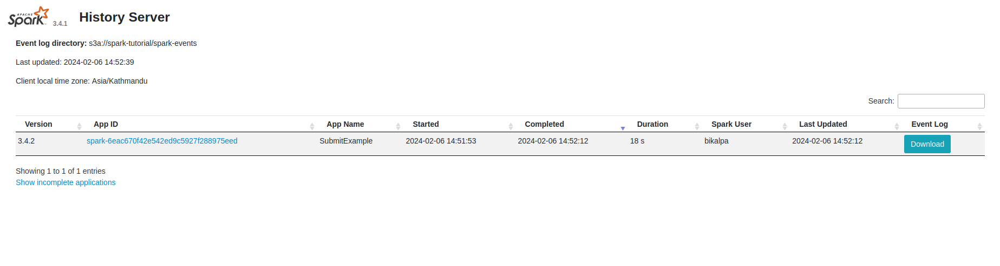
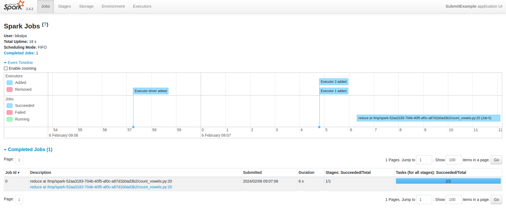
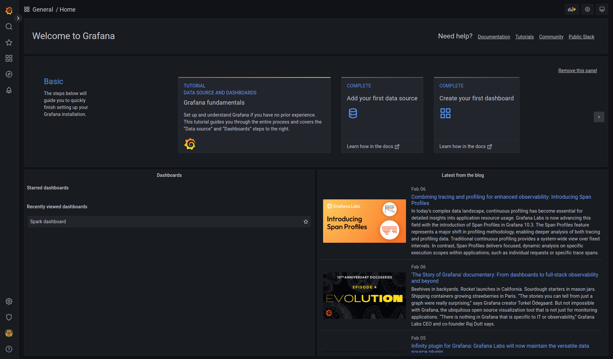
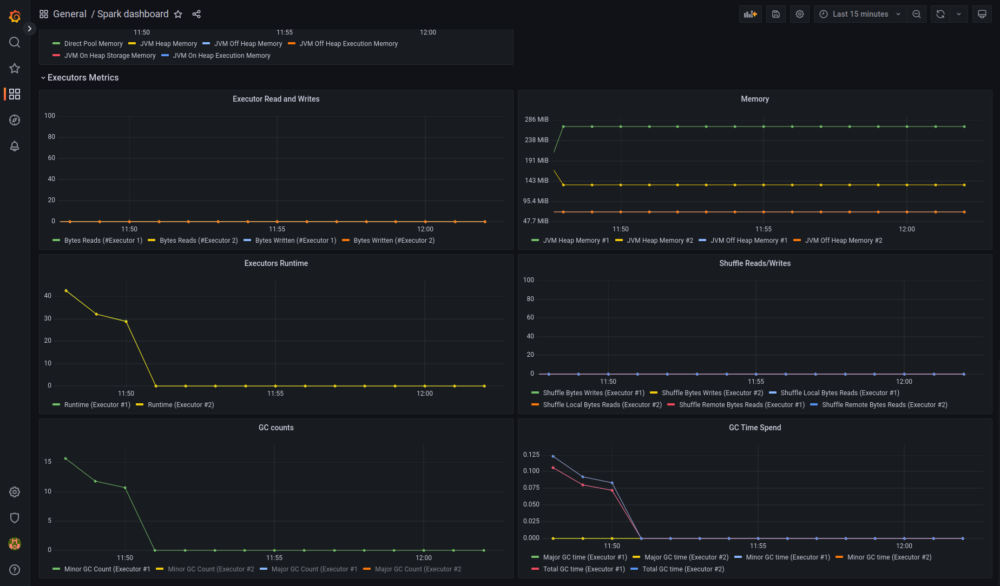

## Monitoring the Spark Cluster

By default, Spark stores the logs of drivers and executors as pod logs in the local file system, which gets lost if the pods are deleted. Spark provides us with the feature to store these logs in S3 so that they can later be retrieved and visualized.

Monitoring of Spark cluster can be done in two ways,
1. Using Spark History Server 
2. Using Canonical Observability Stack (COS)

Let's explore each one of these.

### Monitoring with Spark History Server

Spark History Server is a user interface to monitor the metrics and performance of completed and running Spark applications. The Spark History Server is offered as a charm in the Charmed Spark solution, which can be deployed via Juju.

Let's create a fresh Juju model for the experiments with Spark History server.

```bash
juju add-model history-server
```

To enable monitoring via Spark History server, we must first create a service account with necessary configurations for Spark jobs to store logs in a S3 bucket. Then we need to deploy Spark History server with Juju and configure it to read from the same S3 bucket that the Spark writes logs to.

Since Juju has already created the namespace `history-server`, let's create a new service account in this namespace. We'll reuse configuration options from the existing `spark` service account and a few more configuration options to instruct Spark pn where to store the event logs.

```bash
# Get config from old service account and store in a file
spark-client.service-account-registry get-config \
  --username spark --namespace spark > properties.conf

# Add a few more config options for the storage of event logs
echo "spark.eventLog.enabled=true" >> properties.conf
echo "spark.eventLog.dir=s3a://spark-tutorial/spark-events/" >> properties.conf
echo "spark.history.fs.logDirectory=s3a://spark-tutorial/spark-events/" >> properties.conf

# Create a new service account and load configurations from the file
spark-client.service-account-registry create \
  --username spark --namespace history-server \
  --properties-file properties.conf
```

We've configured Spark to write event logs to `spark-events` directory in the `spark-tutorial` bucket. However, that directory doesn't exist yet. Let's create that directory in S3.

```bash
aws s3api put-object --bucket spark-tutorial --key spark-events/ # / at the end is requied
```

Now, let's deploy the [`spark-history-server-k8s`](https://github.com/canonical/spark-history-server-k8s-operator) charm in our Juju model. 

```bash
juju deploy spark-history-server-k8s -n1 --channel 3.4/stable
```

Spark History Server needs to connect to the S3 bucket for it to be able to read the event logs. This integration is provided to Spark History server charm by the [`s3-integrator`](https://github.com/canonical/s3-integrator) charm. Let's deploy `s3-integrator` charm, configure it and integrate it with `spark-history-server-k8s`.

```bash
# Deploy s3-integrator
juju deploy s3-integrator -n1 --channel edge

# Configure s3-integrator with correct bucket name, directory path and endpoint
juju config s3-integrator bucket=spark-tutorial path="spark-events" endpoint=http://$S3_ENDPOINT

# Sync S3 credentials with s3-integrator
juju run s3-integrator/leader sync-s3-credentials \
  access-key=$ACCESS_KEY secret-key=$SECRET_KEY

# Integrate s3-integrator with Spark History Server
juju integrate s3-integrator spark-history-server-k8s
```

Let's view the status of Juju model at this point with `juju status --watch 1s --relations` command. Once the charms have completed deployment and integration, the status should appear simlar to the following:


```
Model           Controller      Cloud/Region        Version  SLA          Timestamp
history-server  spark-tutorial  microk8s/localhost  3.1.7    unsupported  07:29:35Z

App                       Version  Status  Scale  Charm                     Channel     Rev  Address         Exposed  Message
s3-integrator                      active      1  s3-integrator             edge         14  10.152.183.87   no       
spark-history-server-k8s           active      1  spark-history-server-k8s  3.4/stable   15  10.152.183.111  no       

Unit                         Workload  Agent  Address      Ports  Message
s3-integrator/0*             active    idle   10.1.29.167         
spark-history-server-k8s/0*  active    idle   10.1.29.169         

Integration provider               Requirer                                 Interface            Type     Message
s3-integrator:s3-credentials       spark-history-server-k8s:s3-credentials  s3                   regular  
s3-integrator:s3-integrator-peers  s3-integrator:s3-integrator-peers        s3-integrator-peers  peer   
```

The Spark History Server is now successfully configured to read event logs from S3 bucket. Let's run a simple job so that Spark can generate some event logs. We're going to use the same `count_vowels.py` example we used earlier, which already exists in the `spark-tutorial` bucket.


```bash
spark-client.spark-submit \
    --username spark --namespace history-server \
    --deploy-mode cluster \
    s3a://spark-tutorial/count_vowels.py
```

The Spark History Server comes with a Web UI for us to view and monitor the jobs submitted to Spark Cluster. The web UI can be accessed at port 18080 of the IP address of the `spark-history-server-k8s/0` unit. However, it is a good practice to access it via Ingress rather than directly accessing the unit IP address. Using an Ingress will allow us to have a common entrypoint to the apps running in the Juju model. We can add an Ingress by deploying and integrating [`traefik-k8s`](https://charmhub.io/traefik-k8s) charm with `spark-history-server-k8s`.

```bash
# Deploy traefik charm
juju deploy traefik-k8s --channel latest/candidate --trust

# Integrate traefik with spark-history-server-k8s
juju integrate traefik-k8s spark-history-server-k8s
```

Now that Traefik has been deployed and configured, we can fetch the Ingress URL of Spark History Server by running the `show-proxied-endpoints` action.

```bash
juju run traefik-k8s/0 show-proxied-endpoints
# 
# proxied-endpoints: '{"spark-history-server-k8s": {"url": "http://172.31.19.156/history-server-spark-history-server-k8s"}}'
```

Let's open a web browser and then browse to this URL to see the history server UI similar to the one shown below.



When you click on the app ID, you can see the event timeline for the particular job and the information of completed jobs as shown in the picture below.


In the similar way, you can view information about various stages in the job by navigating to the "Stages" menu. The value of different properties used to run the job can be viewed in the "Environment" page. Finally, you can also view stats about the individual executors in "Executors" page. Spend some time exploring the various pages. You may even submit additional sample jobs and view their status.

### Monitoring with Canonical Observability Stack 

The Charmed Spark solution comes with the [spark-metrics](https://github.com/banzaicloud/spark-metrics) exporter embedded in the [Charmed Spark OCI image](https://github.com/canonical/charmed-spark-rock) which is used as a base image for driver and executors pods.
This exporter is designed to push metrics to the [prometheus pushgateway](https://github.com/prometheus/pushgateway), which in turn is integrated with the [Canonical Observability Stack](https://charmhub.io/topics/canonical-observability-stack). 

In order to enable the observability on Charmed Spark two steps are necessary:

1. Setup the COS (Canonical Observability Stack) bundle with Juju
2. Configure the Spark service account with options to use Prometheus sink

Let's begin by setting up the Canonical Observability Stack bundle. Let's start by creating a fresh Juju model with name `cos`.

```shell
juju add-model cos
```

Now, let's deploy the `cos-lite` charm bundle. 

```shell
juju deploy cos-lite --trust
```

When you deploy `cos-lite`, it deploys several charms like Prometheus, Grafana, Loki, etc. that together build up the Canonical Observability Stack. You can view the list of charms that have been deployed and their relations with `juju status --relations`. The output is similar the following (note that it may take some time for the status to be active for each charms.):

```
Model  Controller  Cloud/Region        Version  SLA          Timestamp
cos    k8s         microk8s/localhost  3.1.7    unsupported  15:41:53+05:45

App           Version  Status  Scale  Charm             Channel  Rev  Address         Exposed  Message
alertmanager  0.25.0   active      1  alertmanager-k8s  stable    96  10.152.183.249  no       
catalogue              active      1  catalogue-k8s     stable    33  10.152.183.165  no       
grafana       9.2.1    active      1  grafana-k8s       stable    93  10.152.183.124  no       
loki          2.7.4    active      1  loki-k8s          stable   105  10.152.183.145  no       
prometheus    2.47.2   active      1  prometheus-k8s    stable   159  10.152.183.129  no       
traefik       2.10.4   active      1  traefik-k8s       stable   166  192.168.10.120  no       

Unit             Workload  Agent  Address       Ports  Message
alertmanager/0*  active    idle   10.1.139.112         
catalogue/0*     active    idle   10.1.139.82          
grafana/0*       active    idle   10.1.139.115         
loki/0*          active    idle   10.1.139.110         
prometheus/0*    active    idle   10.1.139.95          
traefik/0*       active    idle   10.1.139.114         

Integration provider                Requirer                     Interface              Type     Message
alertmanager:alerting               loki:alertmanager            alertmanager_dispatch  regular  
alertmanager:alerting               prometheus:alertmanager      alertmanager_dispatch  regular  
alertmanager:grafana-dashboard      grafana:grafana-dashboard    grafana_dashboard      regular  
alertmanager:grafana-source         grafana:grafana-source       grafana_datasource     regular  
alertmanager:replicas               alertmanager:replicas        alertmanager_replica   peer     
alertmanager:self-metrics-endpoint  prometheus:metrics-endpoint  prometheus_scrape      regular  
catalogue:catalogue                 alertmanager:catalogue       catalogue              regular  
catalogue:catalogue                 grafana:catalogue            catalogue              regular  
catalogue:catalogue                 prometheus:catalogue         catalogue              regular  
catalogue:replicas                  catalogue:replicas           catalogue_replica      peer     
grafana:grafana                     grafana:grafana              grafana_peers          peer     
grafana:metrics-endpoint            prometheus:metrics-endpoint  prometheus_scrape      regular  
grafana:replicas                    grafana:replicas             grafana_replicas       peer     
loki:grafana-dashboard              grafana:grafana-dashboard    grafana_dashboard      regular  
loki:grafana-source                 grafana:grafana-source       grafana_datasource     regular  
loki:metrics-endpoint               prometheus:metrics-endpoint  prometheus_scrape      regular  
loki:replicas                       loki:replicas                loki_replica           peer     
prometheus:grafana-dashboard        grafana:grafana-dashboard    grafana_dashboard      regular  
prometheus:grafana-source           grafana:grafana-source       grafana_datasource     regular  
prometheus:prometheus-peers         prometheus:prometheus-peers  prometheus_peers       peer     
traefik:ingress                     alertmanager:ingress         ingress                regular  
traefik:ingress                     catalogue:ingress            ingress                regular  
traefik:ingress-per-unit            loki:ingress                 ingress_per_unit       regular  
traefik:ingress-per-unit            prometheus:ingress           ingress_per_unit       regular  
traefik:metrics-endpoint            prometheus:metrics-endpoint  prometheus_scrape      regular  
traefik:peers                       traefik:peers                traefik_peers          peer     
traefik:traefik-route               grafana:ingress              traefik_route          regular  
```

At this point, the observability stack has been deployed but Charmed Spark knows nothing about it. Since Charmed Spark comes with a built in spark metrics exporter that exports metric logs to a Prometheus gateway, we need to deploy a Prometheus gateway and then add Spark options to connect to it. The Prometheus gateway in turn will then be integrated with Prometheus. Let's deploy `prometheus-pushgateway-k8s` charm and integrate it with `prometheus` charm.

```bash
juju deploy prometheus-pushgateway-k8s --channel edge

juju integrate prometheus-pushgateway-k8s prometheus
```

Now, for Spark to be able to access the Prometheus gateway, we need the gateway address and port. Let's export them as environment variables so that they can be used later.

```shell
# Get prometheus gateway IP
export PROMETHEUS_GATEWAY=$(juju status --format=json | jq -r '.applications."prometheus-pushgateway-k8s".address') 

export PROMETHEUS_PORT=9091
```

Now that we have Prometheus gateway IP adress and port, let's create a new service account in `cos` namespace with all configuration options as `spark` service account in `spark` namespace with a few additional configuration options related to Prometheus gateway.

```shell
# Get config from old service account and store in a file
spark-client.service-account-registry get-config \
  --username spark --namespace spark > properties.conf

# Create a new service account and load configurations from the file
spark-client.service-account-registry create \
  --username spark --namespace cos \
  --properties-file properties.conf

# Add configuration options related to Prometheus
spark-client.service-account-registry add-config \
  --username spark --namespace cos \
      --conf spark.metrics.conf.driver.sink.prometheus.pushgateway-address=$PROMETHEUS_GATEWAY:$PROMETHEUS_PORT \
      --conf spark.metrics.conf.driver.sink.prometheus.class=org.apache.spark.banzaicloud.metrics.sink.PrometheusSink \
      --conf spark.metrics.conf.driver.sink.prometheus.enable-dropwizard-collector=true \
      --conf spark.metrics.conf.driver.sink.prometheus.period=5 \
      --conf spark.metrics.conf.driver.sink.prometheus.metrics-name-capture-regex='([a-z0-9]*_[a-z0-9]*_[a-z0-9]*_)(.+)' \
      --conf spark.metrics.conf.driver.sink.prometheus.metrics-name-replacement=\$2 \
      --conf spark.metrics.conf.executor.sink.prometheus.pushgateway-address=$PROMETHEUS_GATEWAY:$PROMETHEUS_PORT \
      --conf spark.metrics.conf.executor.sink.prometheus.class=org.apache.spark.banzaicloud.metrics.sink.PrometheusSink \
      --conf spark.metrics.conf.executor.sink.prometheus.enable-dropwizard-collector=true \
      --conf spark.metrics.conf.executor.sink.prometheus.period=5 \
      --conf spark.metrics.conf.executor.sink.prometheus.metrics-name-capture-regex='([a-z0-9]*_[a-z0-9]*_[a-z0-9]*_)(.+)' \
      --conf spark.metrics.conf.executor.sink.prometheus.metrics-name-replacement=\$2
```

Now that Prometheus is configured, let's move on to configure Grafana. For this tutorial, we are going to use a basic Grafana dashboard which is available [here](https://github.com/canonical/charmed-spark-rock/blob/dashboard/dashboards/prod/grafana/spark_dashboard.json). We're going to use [`cos-configuration-k8s`](https://github.com/canonical/cos-configuration-k8s-operator) charm to specify this dashboard to be used by Grafana, and then integrate it with the `grafana` charm. 

```bash
# Deploy cos configuration charm to import the grafana dashboard
juju deploy cos-configuration-k8s \
  --config git_repo=https://github.com/canonical/charmed-spark-rock \
  --config git_branch=dashboard \
  --config git_depth=1 \
  --config grafana_dashboards_path=dashboards/prod/grafana/

# integrate cos-configration charm to import grafana dashboard
juju integrate cos-configuration-k8s grafana
```

Once deployed and integrated, observe the status of the juju model with `juju status --relations`, which should be similar to the following:

```
Model  Controller  Cloud/Region        Version  SLA          Timestamp
cos    k8s         microk8s/localhost  3.1.7    unsupported  17:44:56+05:45

App                         Version  Status  Scale  Charm                       Channel  Rev  Address         Exposed  Message
alertmanager                0.25.0   active      1  alertmanager-k8s            stable    96  10.152.183.249  no       
catalogue                            active      1  catalogue-k8s               stable    33  10.152.183.165  no       
cos-configuration-k8s       3.5.0    active      1  cos-configuration-k8s       stable    42  10.152.183.106  no       
grafana                     9.2.1    active      1  grafana-k8s                 stable    93  10.152.183.124  no       
loki                        2.7.4    active      1  loki-k8s                    stable   105  10.152.183.145  no       
prometheus                  2.47.2   active      1  prometheus-k8s              stable   159  10.152.183.129  no       
prometheus-pushgateway-k8s  1.6.2    active      1  prometheus-pushgateway-k8s  edge       7  10.152.183.36   no       
traefik                     2.10.4   active      1  traefik-k8s                 stable   166  192.168.10.120  no       

Unit                           Workload  Agent  Address       Ports  Message
alertmanager/0*                active    idle   10.1.139.74          
catalogue/0*                   active    idle   10.1.139.100         
cos-configuration-k8s/0*       active    idle   10.1.139.114         
grafana/0*                     active    idle   10.1.139.85          
loki/0*                        active    idle   10.1.139.106         
prometheus-pushgateway-k8s/0*  active    idle   10.1.139.119         
prometheus/0*                  active    idle   10.1.139.99          
traefik/0*                     active    idle   10.1.139.84          

Integration provider                          Requirer                                      Interface                  Type     Message
alertmanager:alerting                         loki:alertmanager                             alertmanager_dispatch      regular  
alertmanager:alerting                         prometheus:alertmanager                       alertmanager_dispatch      regular  
alertmanager:grafana-dashboard                grafana:grafana-dashboard                     grafana_dashboard          regular  
alertmanager:grafana-source                   grafana:grafana-source                        grafana_datasource         regular  
alertmanager:replicas                         alertmanager:replicas                         alertmanager_replica       peer     
alertmanager:self-metrics-endpoint            prometheus:metrics-endpoint                   prometheus_scrape          regular  
catalogue:catalogue                           alertmanager:catalogue                        catalogue                  regular  
catalogue:catalogue                           grafana:catalogue                             catalogue                  regular  
catalogue:catalogue                           prometheus:catalogue                          catalogue                  regular  
catalogue:replicas                            catalogue:replicas                            catalogue_replica          peer     
cos-configuration-k8s:grafana-dashboards      grafana:grafana-dashboard                     grafana_dashboard          regular  
cos-configuration-k8s:replicas                cos-configuration-k8s:replicas                cos_configuration_replica  peer     
grafana:grafana                               grafana:grafana                               grafana_peers              peer     
grafana:metrics-endpoint                      prometheus:metrics-endpoint                   prometheus_scrape          regular  
grafana:replicas                              grafana:replicas                              grafana_replicas           peer     
loki:grafana-dashboard                        grafana:grafana-dashboard                     grafana_dashboard          regular  
loki:grafana-source                           grafana:grafana-source                        grafana_datasource         regular  
loki:metrics-endpoint                         prometheus:metrics-endpoint                   prometheus_scrape          regular  
loki:replicas                                 loki:replicas                                 loki_replica               peer     
prometheus-pushgateway-k8s:metrics-endpoint   prometheus:metrics-endpoint                   prometheus_scrape          regular  
prometheus-pushgateway-k8s:pushgateway-peers  prometheus-pushgateway-k8s:pushgateway-peers  pushgateway_peers          peer     
prometheus:grafana-dashboard                  grafana:grafana-dashboard                     grafana_dashboard          regular  
prometheus:grafana-source                     grafana:grafana-source                        grafana_datasource         regular  
prometheus:prometheus-peers                   prometheus:prometheus-peers                   prometheus_peers           peer     
traefik:ingress                               alertmanager:ingress                          ingress                    regular  
traefik:ingress                               catalogue:ingress                             ingress                    regular  
traefik:ingress-per-unit                      loki:ingress                                  ingress_per_unit           regular  
traefik:ingress-per-unit                      prometheus:ingress                            ingress_per_unit           regular  
traefik:metrics-endpoint                      prometheus:metrics-endpoint                   prometheus_scrape          regular  
traefik:peers                                 traefik:peers                                 traefik_peers              peer     
traefik:traefik-route                         grafana:ingress                               traefik_route              regular  
```

Now that we have the observability stack up and running, let's run a simple Spark job so that the metric logs are pushed to the Prometheus gateway. For simplicity, we're going to use the same `count_vowels.py` script that we had prepared in the earlier sections.

```bash
spark-client.spark-submit \
    --username spark --namespace cos \
    --deploy-mode cluster \
    s3a://spark-tutorial/count_vowels.py
```

Once the job completes the execution, let's try to open the Grafana web UI and see the metrics. The credentials for the built-in `admin` user and the URL to the web UI can be fetched using the `get-admin-password` action exposed by `grafana` charm:

```bash
juju run grafana/leader get-admin-password
# ...
# admin-password: w5lk07PIW5U0
# url: http://192.168.10.120/cos-grafana
```

Open the URL in a web browser. Log in using `admin` as the username and the password just fetched in the earlier command. We can see the Grafana web UI similar to the one shown below.



In the navigation menu on the left, select "Dashboards" and then "Browse". There you can see "Spark Dashboard" listed. You'll see the dashboard similar to the one shown in the picture below. This is the dashboard we configured earlier with `cos-configuration-k8s` charm.



Play around the dashboard and observe the various metrics like Block Manager memory, JVM Executor Memory, etc. You can also reduce the time range to further zoom into the time graph.


In the next section, we are going to wrap up with the tutorial and clean up all the resources we created.